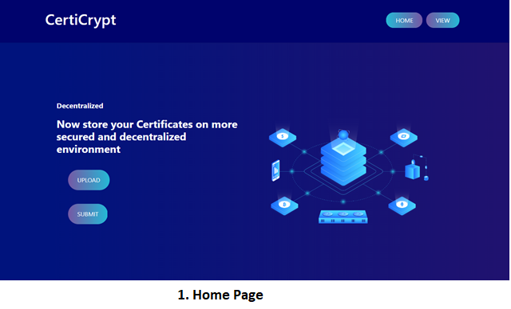
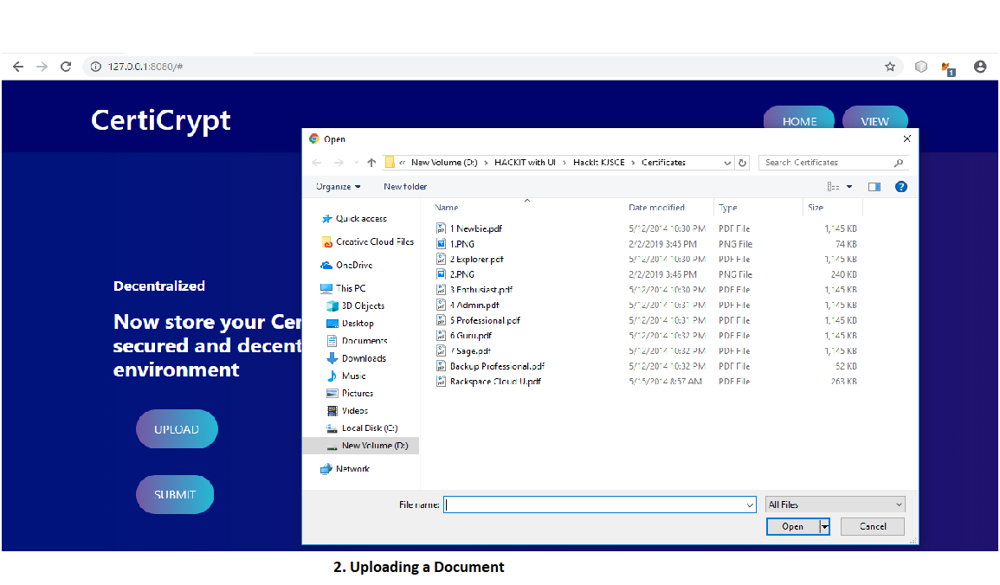
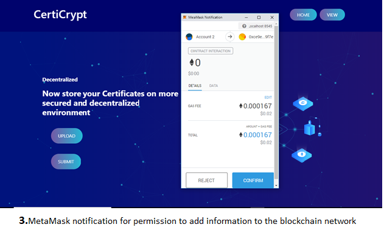
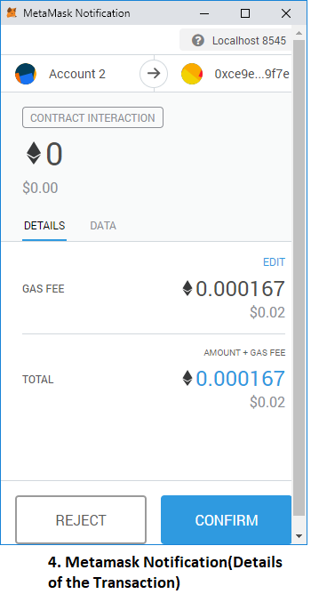
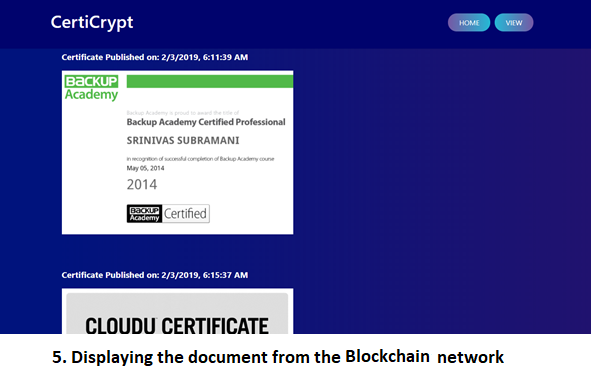

# CertiCrypt
Submission for KJSCE TechNext HackIT Hackathon 2019: Decentralized storage of documents using Blockchain by implementing IPFS, Smart Contract and MetaMask

# Overview
In the current scenario, the documents are stored in a centralized repository, such as documents of University, Government organizations, Banks, etc. These Centralized repository can be hacked, and data can be manipulated or forged. So, there needs to be a secure way to store these documents and it should be available at any given point of time. 

### Key Features
- Certicrypt is a private block chain running on ethereum network for storing documents securely It offers a full suite of structured and easily accessible record keeping for organizations and individuals. 
- The file isn’t stored in the blockchain network but its IPFS hash (using INFURA API) gets stored in the blockchain which reduces the overhead such as cost, configuration and scale of the infrastructure.
- CertiCrypt creates a platform for structured storage over the decentralized network for the ease of data access and security among peers and capitalizes over the pros of the Blockchain network to create an ecosystem for secure transfer, authorization, integrity, and authenticity of data.

---------------------------------------------------------------------------------

## Screenshots

---------------------------------------------------------------------------------
## Project Demo
<a href="https://youtu.be/y5lPvqmtv30">Application Demo</a>

----------------------------------------------------------------------------------

### Contributors
- [@ssvas1997](https://github.com/ssvas1997)
- [@joshiadvait8](https://github.com/joshiadvait8)
- [@jethavabhavik07](https://github.com/jethavabhavik07)
- [@shahviram](https://github.com/shahviram)

